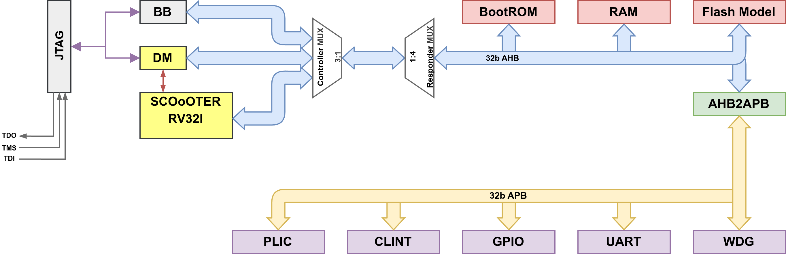

# SCOoOTER + BlueJ debug demo

This project combines the SCOoOTER RISC-V core with BlueJ's JTAG,
RISC-V Debug Module, and BlueBus support.

The project owns only the SoC integration in `src/`, its testbench, boot ROM,
and board wrapper. SCOoOTER, BlueJ, BSVTools, and the reusable peripheral and
bus libraries are Git submodules under `dep/`.

## Checkout and toolchain

Clone the repository, then initialize its top-level submodules. This checks
out every dependency required by the demo from the compatible revisions
pinned in `dep/`.

```sh
git clone <repository-url> scoooter-bluej-demo
cd scoooter-bluej-demo
git submodule update --init
nix develop ./nix
```

The update is intentionally not recursive; nested development submodules of
SCOoOTER and the other dependencies are not required.

The Makefile uses BSVTools' standard library discovery. There is a BSVTools adapter
inside `libraries/` for SCOoOTER as it does not have native BSVTools integration.

The firmware is freestanding RV32I. `make firmware` builds the application,
links its runtime VMA in RAM while assigning its load address in the flash
window, and emits `firmware/demo.hex`. The hex file contains a four-word magic
header followed by the contiguous, flat firmware binary; no ELF parser or custom image
packer is needed in the bootrom. 
`make compile` builds both firmware images before compiling the SoC.

## SoC architecture



The LSU has fixed priority over instruction fetches. The AHB mux combines the
core, RISC-V Debug Module system-bus access, and BlueBus access before address
decoding. Abstract debug-register accesses use the direct debug-hart path and
do not traverse the system bus.

## Demo software

At reset, the boot ROM validates the preloaded flash header, copies the
application to RAM, and jumps to it; a bad image instead produces a visible
GPIO error pattern. The application initializes its C runtime and trap entry,
then drives the LEDs from periodic CLINT timer interrupts and GPIO interrupts
routed through the PLIC.

The bounded simulation checks the boot handoff, pulses GPIO bit 2 as the FPGA
button, and only passes after observing the expected boot, timer, and button
effects on the GPIO outputs. The separate OpenOCD/GDB regression exercises the
JTAG Debug Module by loading RAM, single-stepping, and inserting and removing a
software breakpoint.

## Simulation

Compile the native Bluesim testbench:

```sh
make compile
```

Run the remote-bitbang simulation in one terminal. It waits for OpenOCD:

```sh
make sim
```

For a bounded boot and interrupt self-test that does not require OpenOCD:

```sh
make FINITE_TEST=1 sim
```

Connect OpenOCD from a second terminal:

```sh
openocd -f openocd.cfg
```

Build the RV32 test image and run the GDB batch script from a third terminal:

```sh
make scoooter-gdb-elf
gdb-multiarch -q -batch -x test/scoooter_gdb.gdb build/scoooter-gdb.elf
```

The current SoC integration exposes one hart to the RISC-V Debug Module and
OpenOCD.

To use BlueJ's custom BlueBus scan without creating a RISC-V target:

```sh
openocd -c "set SCOOOTER_RISCV_TARGET 0" -f openocd.cfg
```

The OpenOCD telnet console then provides `bluebus_read32` and
`bluebus_write32`.

## Memory map

| Base | Size | Target |
| --- | ---: | --- |
| `0x0000_0000` | 4 KiB | Boot ROM |
| `0x2000_0000` | 64 KiB | Preloaded read-only flash image |
| `0x4000_0000` | 8 MiB | APB bridge |
| `0x8000_0000` | 64 KiB | RAM |

| Address | Size | Target |
| --- | ---: | --- |
| `0x4000_0000` | 4 KiB | BlueUART |
| `0x4000_1000` | 4 KiB | BlueGPIO |
| `0x4000_2000` | 4 KiB | Watchdog |
| `0x4000_3000` | 4 KiB | CLINT (`mtime`/`mtimecmp`) |
| `0x4040_0000` | 4 MiB | PLIC |

## Interrupt map

| Core interrupt | `mcause` | Source | Route |
| --- | ---: | --- | --- |
| Machine software (`MSIP`) | 3 | None | Tied low |
| Machine timer (`MTIP`) | 7 | CLINT | Direct to the hart |
| Machine external (`MEIP`) | 11 | PLIC | PLIC output to the hart |

PLIC source ID 0 means no interrupt and is not assigned to a device. The
implemented external sources are:

| PLIC source ID | Interrupt-vector slot | Source |
| ---: | ---: | --- |
| 1 | 0 | GPIO, any enabled GPIO event |
| 2-12 | 1-11 | Unused |
| 13 | 12 | Watchdog timeout |
| 14-16 | 13-15 | Unused |

The UART has no interrupt connection in the current integration. The demo
firmware enables PLIC source 1 for the simulated button and programs the CLINT
separately for periodic timer interrupts; source 13 is wired and handled but
the demo does not start the watchdog.

## Cmod A7 flow

The board-specific wrapper, constraints, OpenOCD configuration, and Vivado
scripts are isolated in `fpga/cmoda7`. These flows are intentionally separate
from the simulation-first root Makefile:

```sh
make -C fpga/cmoda7 synth
make -C fpga/cmoda7 bitstream
make -C fpga/cmoda7 program
make -C fpga/cmoda7 program-flash
```

The board flow targets `xc7a35tcpg236-1`. The generated bitstream and flash
image are placed below `build/ScoooterCmodA7/`. The hardware OpenOCD setup is
`fpga/cmoda7/openocd.cfg`.

## Project layout

```text
bootrom/          Minimal RV32 boot ROM
firmware/         Flash-linked interrupt demo application
dep/              Git submodules only
fpga/cmoda7/      Board wrapper, constraints, and Vivado/OpenOCD scripts
libraries/        BSVTools dependency integration metadata
nix/              Reproducible development shell
src/              Demo-owned SCOoOTER/BlueJ SoC integration
test/             Remote-bitbang testbench and GDB regression
```
